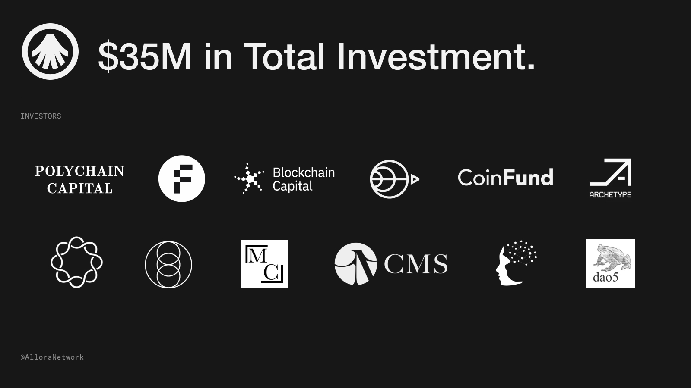

# Allora Network Worker Node Setup Guide

<p align="center">

<a href="https://goreportcard.com/badge/github.com/allora-network/allora-chain">
    
</a>
</p>


The Allora Network is a state-of-the-art protocol that uses decentralized AI and machine learning (ML) to build, extract, and deploy predictions among its participants. It offers actors who wish to use AI predictions a formalized way to obtain the output of state-of-the-art ML models on-chain and to pay the operators of AI/ML nodes who create these predictions. That way, Allora bridges the information gap between data owners, data processors, AI/ML predictors, market analysts, and the end-users or consumers who have the means to execute on these insights.

The AI/ML agents within the Allora Network use their data and algorithms to broadcast their predictions across a peer-to-peer network, and they ingest these predictions to assess the predictions from all other agents. The network consensus mechanism combines these predictions and assessments, and distributes rewards to the agents according to the quality of their predictions and assessments. This carefully designed incentive mechanism enables Allora to continually learn and improve, adjusting to the market as it evolves.


## Documentation
For the latest documentation [HERE](https://docs.allora.network) and [Repo HERE](https://github.com/allora-network/allora-chain)

# [How to install Linux on Windows with WSL](https://learn.microsoft.com/en-us/windows/wsl/install)


## Install Node Windows WSL Open PowerShell Following Command

# 1 Install Packages

```
sudo apt update & sudo apt upgrade -y
sudo apt install ca-certificates zlib1g-dev libncurses5-dev libgdbm-dev libnss3-dev curl git wget make jq build-essential pkg-config lsb-release libssl-dev libreadline-dev libffi-dev gcc screen unzip lz4 -y
```

# 2 Install Python3

2.1
``` 
sudo apt install python3
```
2.2
```
python3 --version
```
2.3
```
sudo apt install python3-pip
```
2.4
```
pip3 --version
```

# 3 Install Docker

3.1
```
curl -fsSL https://download.docker.com/linux/ubuntu/gpg | sudo gpg --dearmor -o /usr/share/keyrings/docker-archive-keyring.gpg
```

3.2
```
echo "deb [arch=$(dpkg --print-architecture) signed-by=/usr/share/keyrings/docker-archive-keyring.gpg] https://download.docker.com/linux/ubuntu $(lsb_release -cs) stable" | sudo tee /etc/apt/sources.list.d/docker.list > /dev/null
```

3.3
```
sudo apt-get update
sudo apt-get install docker-ce docker-ce-cli containerd.io
docker version
```

# 4 Install Docker-Compose

4.1
```
VER=$(curl -s https://api.github.com/repos/docker/compose/releases/latest | grep tag_name | cut -d '"' -f 4)
```
4.2
```
sudo curl -L "https://github.com/docker/compose/releases/download/$VER/docker-compose-$(uname -s)-$(uname -m)" -o /usr/local/bin/docker-compose
sudo chmod +x /usr/local/bin/docker-compose
```
4.3
```
docker-compose --version
```

# 5 Docker Permission to user

5.1
```
sudo groupadd docker
```

5.2
```
sudo usermod -aG docker $USER
```

# 6 Install Go

6.1
```
sudo rm -rf /usr/local/go
```
6.2
```
curl -L https://go.dev/dl/go1.22.4.linux-amd64.tar.gz | sudo tar -xzf - -C /usr/local
```
6.3
```
echo 'export PATH=$PATH:/usr/local/go/bin:$HOME/go/bin' >> $HOME/.bash_profile
echo 'export PATH=$PATH:$(go env GOPATH)/bin' >> $HOME/.bash_profile
```
6.4
```
source .bash_profile
```
6.5
```
go version
```

# 7 Install Allorad Wallet
7.1
```
git clone https://github.com/allora-network/allora-chain.git
```
7.2
```
cd allora-chain && make all
```
7.3
```
allorad version
```

# 8 Create a New Wallet & Save You 24 Word Phrase

```
allorad keys add testkey
```

# 9 Import Your 24 Word Phrase in [Keplr Wallet](https://www.keplr.app)

### 9.1 Add Chain to Keplr > [Go To HERE](https://explorer.testnet.allora.network/wallet/keplr?chain=testnet)

### 9.2 Register With Keplr > [Go To HERE](https://app.allora.network?ref=eyJyZWZlcnJlcl9pZCI6IjUxYTU2ZmJhLWMwODItNGIxNy1hOGVmLTE5ZTc5YWE4ZWU5MiJ9) 

### 9.3 Claim Faucet > [Go To HERE](https://faucet.testnet-1.testnet.allora.network)


# 10 Install Worker

### 10.1 Install

10.1.1
```
cd $HOME && git clone https://github.com/allora-network/basic-coin-prediction-node
```
10.1.2
```
cd basic-coin-prediction-node
```
10.1.3
```
mkdir worker-data
```
10.1.4
```
mkdir head-data
```
10.1.5
```
ls
```

### 10.2 Give Certain Permissions

10.2.1
```
sudo chmod -R 777 worker-data
```
10.2.2
```
sudo chmod -R 777 head-data
```

### 10.3 Create head keys

```
sudo docker run -it --entrypoint=bash -v ./head-data:/data alloranetwork/allora-inference-base:latest -c "mkdir -p /data/keys && (cd /data/keys && allora-keys)"
```

### 10.4 Create worker keys

```
sudo docker run -it --entrypoint=bash -v ./worker-data:/data alloranetwork/allora-inference-base:latest -c "mkdir -p /data/keys && (cd /data/keys && allora-keys)"
```

# 11 Copy Your Head-id starts with 12D & Save NotePad

```
cat head-data/keys/identity
```

# 12 Connect to Allora Chain

### 12.1 Delete and create new docker-compose.yml file

```
rm -rf docker-compose.yml && nano docker-compose.yml
```

### 12.2 Copy & Paste the following code in it Replace Your Head-id & WALLET_SEED_PHRASE

```
version: '3'

services:
  inference:
    container_name: inference-basic-eth-pred
    build:
      context: .
    command: python -u /app/app.py
    ports:
      - "8000:8000"
    networks:
      eth-model-local:
        aliases:
          - inference
        ipv4_address: 172.22.0.4
    healthcheck:
      test: ["CMD", "curl", "-f", "http://localhost:8000/inference/ETH"]
      interval: 10s
      timeout: 5s
      retries: 12
    volumes:
      - ./inference-data:/app/data

  updater:
    container_name: updater-basic-eth-pred
    build: .
    environment:
      - INFERENCE_API_ADDRESS=http://inference:8000
    command: >
      sh -c "
      while true; do
        python -u /app/update_app.py;
        sleep 24h;
      done
      "
    depends_on:
      inference:
        condition: service_healthy
    networks:
      eth-model-local:
        aliases:
          - updater
        ipv4_address: 172.22.0.5

  worker:
    container_name: worker-basic-eth-pred
    environment:
      - INFERENCE_API_ADDRESS=http://inference:8000
      - HOME=/data
    build:
      context: .
      dockerfile: Dockerfile_b7s
    entrypoint:
      - "/bin/bash"
      - "-c"
      - |
        if [ ! -f /data/keys/priv.bin ]; then
          echo "Generating new private keys..."
          mkdir -p /data/keys
          cd /data/keys
          allora-keys
        fi
        # Change boot-nodes below to the key advertised by your head
        allora-node --role=worker --peer-db=/data/peerdb --function-db=/data/function-db \
          --runtime-path=/app/runtime --runtime-cli=bls-runtime --workspace=/data/workspace \
          --private-key=/data/keys/priv.bin --log-level=debug --port=9011 \
          --boot-nodes=/ip4/172.22.0.100/tcp/9010/p2p/'head-id' \
          --topic=1 \
          --allora-chain-key-name=testkey \
          --allora-chain-restore-mnemonic='WALLET_SEED_PHRASE' \
          --allora-node-rpc-address=https://allora-rpc.edgenet.allora.network/ \
          --allora-chain-topic-id=1
    volumes:
      - ./worker-data:/data
    working_dir: /data
    depends_on:
      - inference
      - head
    networks:
      eth-model-local:
        aliases:
          - worker
        ipv4_address: 172.22.0.10

  head:
    container_name: head-basic-eth-pred
    image: alloranetwork/allora-inference-base-head:latest
    environment:
      - HOME=/data
    entrypoint:
      - "/bin/bash"
      - "-c"
      - |
        if [ ! -f /data/keys/priv.bin ]; then
          echo "Generating new private keys..."
          mkdir -p /data/keys
          cd /data/keys
          allora-keys
        fi
        allora-node --role=head --peer-db=/data/peerdb --function-db=/data/function-db  \
          --runtime-path=/app/runtime --runtime-cli=bls-runtime --workspace=/data/workspace \
          --private-key=/data/keys/priv.bin --log-level=debug --port=9010 --rest-api=:6000
    ports:
      - "6000:6000"
    volumes:
      - ./head-data:/data
    working_dir: /data
    networks:
      eth-model-local:
        aliases:
          - head
        ipv4_address: 172.22.0.100


networks:
  eth-model-local:
    driver: bridge
    ipam:
      config:
        - subnet: 172.22.0.0/24

volumes:
  inference-data:
  worker-data:
  head-data:
```

## To save: CTRL+X Then Enter Y Then Enter

# 13 Run Worker
13.1
```
sudo docker compose build
```
13.2
```
sudo docker compose up -d
```

# 14 Check Your Node Worker Container ID & Copy

```
docker ps
```

# 15 Replace Your_CONTAINER_ID & Run

```
docker logs -f Your_CONTAINER_ID
```

## Success: Register Node Tx Hash:= XXXXXX (Copy and Save Note)

# 16 Now You Can Check Your Status By Running This Command & Restart

### 1 Open WSL/docker

### 2 
```
cd basic-coin-prediction-node
```
### 3
```
sudo docker compose up -d
```
### 4 
```
docker ps
```

# More Latest Update [Join Telegram Here](https://t.me/hiddengemnews)


